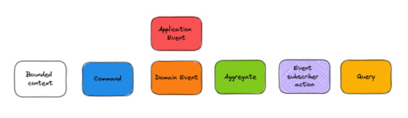
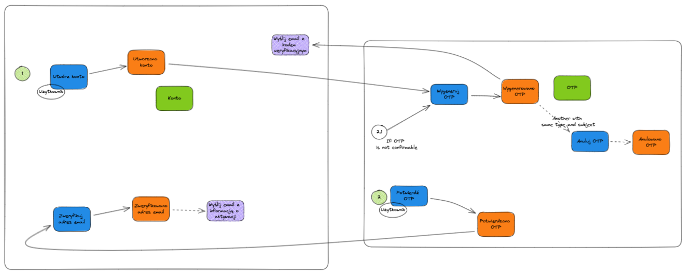

## Information
Built on Laravel, with restructured namespaces and with CQRS and DDD implementation.

## Struct

- Namespace `App` - Main project registers like general exceptions, providers or global services 
```
src/App
    ├── Exceptions
    ├── Providers
    └── Services
```

- Namespace `Contexts` - Bounded contexts with business logic 
```
src/Contexts
    ├── Shared
        ├── Aggregate
        ├── Events
        └── ValueObjects
    └── Account
        ├── Application
            ├── Commands
            ├── Events
            ├── EventSubscribers
            ├── Exceptions
            ├── Models
            ├── Notifications
            ├── Queries
            └── Repositories
        ├── Domain
            ├── Commands
            ├── Entities
            ├── Events
            ├── Exceptions
            ├── Repositories
            └── ValueObjects
        └── Infrastructure
            └── Repositories
```

- Namespace `UI` - User Interfaces manages requests and responses from different input systems
```
src/UI
    ├── Api
        ├── Controllers
        ├── Middleware
        ├── Requests
        ├── Responses
        └── Routes
    ├── Broadcast
    ├── Console
    └── Web
        ├── Controllers
        ├── Middleware
        ├── Requests
        ├── Responses
        └── Routes
```

- Other elements like config, database or resources are same as default Laravel

## Flow



Each Bounded Context consists of 3 layers: domain, application and infrastructure.

The domain layer contains the business logic (elements of changing the state of the system from a business point of view). This layer consists mainly of
Commands, Events and Aggregates. In addition to them, there are also ValueObjects (Ent components), Exceptions and Entity repository interfaces.
The domain is treated immunitatively.

The Application Layer includes Command Handlers, Events, Events Handlers (Subscribers), Queries, Data Models (read only), Exceptions, Notifications, Read Model repository interfaces.

The Integration Layer is a place containing the implementation of repositories from the Application and Domain layers. Changes in this layer do not affect the operation of the system in the context of logic.

The transition between Bounded Contexts is done by emitting Events.

## Important commands

- `make init-composer-packages` - Only first time - initialize Sail
- `make init-dev` - Initialize project 
- `make test` - Run code tests
- `make code-coverage` - Make code coverage report

## Test API Requests in Storm
Open some request from `.httpRequests/Accounts` and click run with defined env file 
